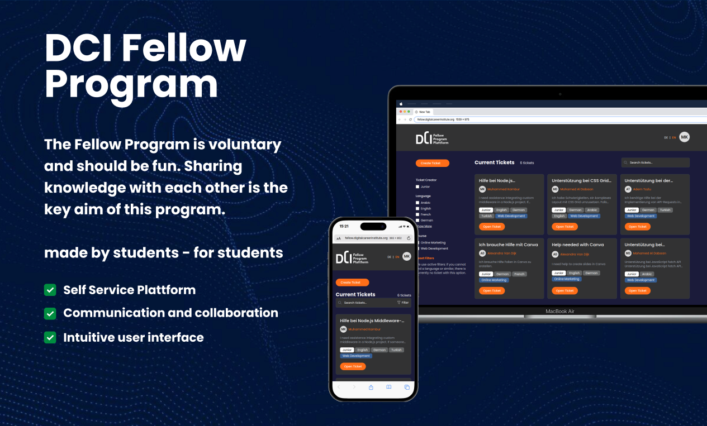
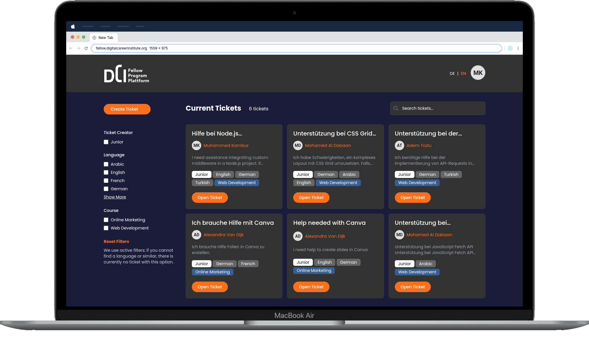

# DCI Fellow Program

## Überblick

Das DCI Fellow Program ist eine umfassende Webanwendung, die entwickelt wurde, um die Aktivitäten des Digital Career Institute zu verwalten und zu erleichtern. Dieses Projekt nutzt einen modernen Technologie-Stack, einschließlich eines React-Frontends mit Vite und Tailwind CSS sowie eines Express-Backends mit MongoDB. Die Anwendung unterstützt die Benutzerauthentifizierung, das Benutzermanagement, das Ticketmanagement und bietet ein responsives Design, das für verschiedene Geräte geeignet ist.

## Screenshots

   
   
  

## Funktionen

### Ticketmanagement

- **Tickets erstellen**: Benutzer können neue Tickets erstellen, indem sie den Titel, die Sprache, den Kurs und die Beschreibung angeben.
- **Tickets anzeigen**: Benutzer können Details einzelner Tickets anzeigen.
- **Tickets filtern und suchen**: Benutzer können Tickets nach Sprache, Kurs und Position filtern und nach Schlüsselwörtern suchen.
- **Paginierung**: Tickets werden zur besseren Benutzererfahrung paginiert.
- **Tickets löschen**: Administratoren können einzelne oder mehrere Tickets löschen.

### Benutzermanagement

- **CRUD-Operationen**: Administratoren können Benutzerkonten erstellen, lesen, aktualisieren und löschen.
- **Profilverwaltung**: Benutzer können ihre Profile anzeigen und bearbeiten.
- **Suchen und Filtern**: Benutzer können andere Benutzer nach E-Mail suchen und filtern.

### Benutzerauthentifizierung und -autorisierung

- **Login und Registrierung**: Benutzer können sich registrieren und in die Anwendung einloggen.
- **JWT-Authentifizierung**: Sichere Authentifizierung mit JSON Web Tokens (JWT).
- **Rollenbasierte Zugriffskontrolle**: Verschiedene Zugriffsebenen für reguläre Benutzer und Administratoren.

### Dashboard

- **Admin-Dashboard**: Bietet einen Überblick über Tickets und Benutzeraktivitäten.
- **Sortieren und Filtern**: Tickets können nach Datum sortiert und nach verschiedenen Kriterien gefiltert werden.

### Responsives Design

- **Mobilfreundlich**: Die Anwendung ist so gestaltet, dass sie responsiv ist und gut auf mobilen Geräten funktioniert.
- **Dynamische Layouts**: Layouts passen sich basierend auf der Bildschirmgröße an, um eine optimale Benutzererfahrung zu bieten.

## Verwendete Technologien

### Frontend

- **React**: Eine JavaScript-Bibliothek zum Erstellen von Benutzeroberflächen.
- **Vite**: Ein Build-Tool, das eine schnelle Entwicklungsumgebung bietet.
- **Tailwind CSS**: Ein Utility-First CSS-Framework für die schnelle UI-Entwicklung.
- **React Router**: Zum Handling von Routen in der Anwendung.
- **Redux**: Für das Zustandsmanagement.
- **React Icons**: Zum Einbinden von Icons in die Anwendung.

### Backend

- **Express**: Ein Webanwendungs-Framework für Node.js.
- **MongoDB**: Eine NoSQL-Datenbank zum Speichern von Anwendungsdaten.
- **Mongoose**: Eine ODM (Object Data Modeling) Bibliothek für MongoDB und Node.js.
- **JWT**: Für sichere Authentifizierung.

## Projektstruktur

### Frontend

- **Components**: Wiederverwendbare UI-Komponenten.
- **Pages**: Verschiedene Seiten der Anwendung (Home, Login, Register, etc.).
- **Admin**: Admin-spezifische Komponenten und Seiten.
- **Utils**: Dienstprogramme und Konstanten.
- **Assets**: Statische Assets wie Bilder und Icons.

### Backend

- **Routes**: API-Routen für Benutzer- und Ticketmanagement.
- **Models**: Mongoose-Modelle für MongoDB-Sammlungen.
- **Controllers**: Logik zum Handling von API-Anfragen.
- **Middleware**: Middleware-Funktionen für Authentifizierung und Fehlerbehandlung.

## Team

Adem Tozlu - [GitHub](https://github.com/Adem-Tozlu/), [LinkedIn](https://www.linkedin.com/in/adem-tozlu), [Portfolio](http://adem-tozlu.vercel.app/) 
Mohamed Al Dabaan - [GitHub](https://github.com/Mohamed-aldabaan), [LinkedIn](https://www.linkedin.com/in/mohamed-al-dabaan-37a039295/), [Portfolio](https://portfolio-eight-zeta-22.vercel.app/) 
Muhammed Kambur - [GitHub](https://github.com/mkamburdev), [LinkedIn](https://linkedin.com/in/mkambur), [Portfolio](https://mkambur.com/)
